# ][-pix

][-pix is an image conversion utility targeting Apple II graphics modes, currently Double Hi-Res.

## Installation

Requires:
*  python 3.x
*  [numpy](http://numpy.org/)
*  [cython](https://cython.org/)
*  [colour-science](https://www.colour-science.org/)

To build ][-pix, run the following commands:

```buildoutcfg
# Compile cython code
python setup.py build_ext --inplace

# Precompute colour distance matrix for one/all colour palettes
python precompute_distance.py --all  # or --palette <palette>
```

## Usage

Then, to convert an image, the simplest usage is:

```buildoutcfg
python convert.py <input> <output.dhr>
```

By default preview image will be shown after conversion, and saved as `<output>-preview.png`, and `<output.dhr>` contains the double-hires image data in a form suitable for transfer to an Apple II disk image.  The 16k output consists of 8k AUX data first, 8K MAIN data second (this matches the output format of other DHGR image converters).  i.e. if loaded at 0x2000, the contents of 0x2000..0x3fff should be moved to 0x4000..0x5fff in AUX memory, and the image can be viewed on DHGR page 2.

For other available options, use `python convert.py --help`

TODO: document flags

## Examples

See [here](examples/gallery.md) for more sample image conversions.

### Original

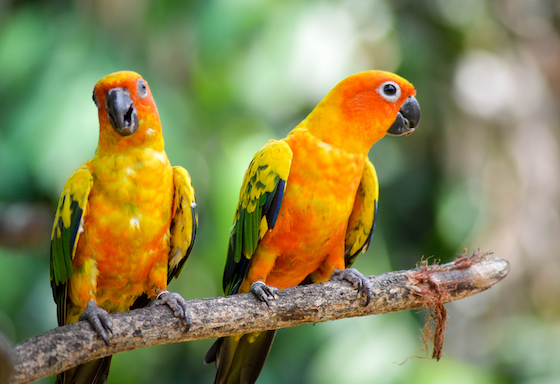

 (Source: [Shreygadgil](https://commons.wikimedia.org/wiki/File:Vibrant_Wings.jpg), [CC BY-SA 4.0](https://creativecommons.org/licenses/by-sa/4.0), via Wikimedia Commons)

### ][-pix preview image

This image was generated using

```buildoutcfg
python convert.py --lookahead 8 --palette openemulator examples/parrots-original.png examples/parrots-iipix-openemulator.dhr
```

The resulting ][-pix preview PNG image is shown here.

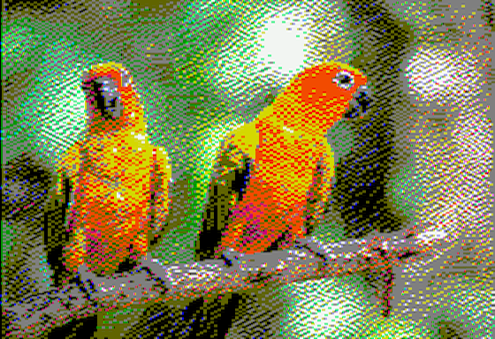

### OpenEmulator screenshot

This is a screenshot taken from OpenEmulator when viewing the Double Hi-res image.

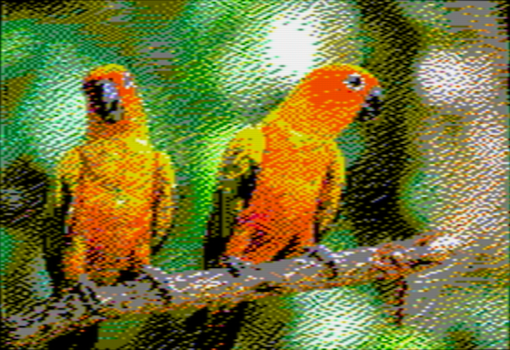

Some difference in colour tone is visible due to blending of colours across pixels (e.g. brown blending into grey, in the background).  This is due to the fact that OpenEmulator simulates the reduced chroma bandwidth of the NTSC signal.

][-pix also allows modeling this NTSC signal behaviour, which effectively allows access to more than 16 DHGR colours, through carefully chosen sequences of pixels (see below for more details).  The resulting images have much higher quality, but only when viewed on a suitable target (e.g. OpenEmulator, or real hardware).  On other targets the colour balance tends to be skewed, though image detail is still good.

This is an OpenEmulator screenshot of the same image converted with `--resolution=ntsc` instead of `--resolution=560`.  Colour match to the original is substantially improved, and more colour detail is visible, e.g. in the shading of the background.

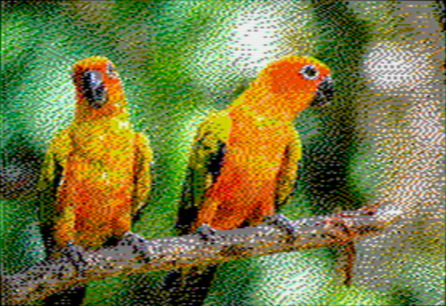


## Some background on Apple II Double Hi-Res graphics

Like other (pre-//gs) Apple II graphics modes, Double Hi-Res relies on [NTSC Artifact Colour](https://en.wikipedia.org/wiki/Composite_artifact_colors), which means that the colour of a pixel is entirely determined by its horizontal position on the screen, and the on/off status of preceding horizontal pixels.

In Double Hi-Res mode, the 560 horizontal pixels per line are individually addressable.  This is an improvement over the (single) Hi-Res mode, which also has 560 horizontal pixels, but which can only be addressed in groups of two (with an option to shift blocks of 7 pixels each by one dot).  See _Assembly Lines: The Complete Book_ (Wagner) for a detailed introduction to this, or _Understanding the Apple IIe_ (Sather) for a deep technical discussion.

Double Hi-Res is usually characterized as being capable of producing 16 display colours, but with heavy restrictions on how these colours can be arranged horizontally.

### Naive model: 140x192x16

One simple model for Double Hi-Res graphics is to only treat the display in groups of 4 horizontal pixels, which gives an effective resolution of 140x192 in 16 colours (=2^4).  These 140 pixel colours can be chosen independently, which makes this model easy to think about and to work with (e.g. when creating images by hand).  However the resulting images will exhibit (sometimes severe) colour interference/fringing effects when two colours are next to one another, because the underlying hardware does not actually work this way.  See below for an example image conversion, showing the unwanted colour fringing that results. 

### Simplest realistic model: 560 pixels, 4-pixel colour

A more complete model for thinking about DHGR comes from looking at how the NTSC signal produces colour on the display.
The [NTSC chrominance subcarrier](https://en.wikipedia.org/wiki/Chrominance_subcarrier) completes one complete phase cycle in the time taken to draw 4 horizontal dots.  The colours produced are due to the interactions of the pixel luminosity (on/off) relative to this NTSC chroma phase.

What this means is that the colour of each of the 560 horizontal pixels is determined by the current pixel value (on/off), the current X-coordinate modulo 4 (X coordinate relative to NTSC phase), as well as the on-off status of the pixels to the left of it.

The simplest approximation is to only look at the current pixel value and the 3 pixels to the left, i.e. to consider a sliding window of 4 horizontal pixels moving across the screen from left to right.  Within this window, we have one pixel for each of the 4 values of NTSC phase (x % 4, ranging from 0 .. 3).  The on-off values for these 4 values of NTSC phase determine the colour of the pixel.  See [here](https://docs.google.com/presentation/d/1_eqBknG-4-llQw3oAOmPO3FlawUeWCeRPYpr_mh2iRU/edit) for more details.

This model allows us to understand and predict the interference behaviour when two "140px" colours are next to each other, and to go beyond this "140px" model to take more advantage of the true 560px horizontal resolution.

If we imagine drawing pixels from left to right across the screen, at each pixel we only have *two* accessible choices of colour: those resulting from turning the current pixel on, or off.  Which two particular colours are produced are determined by the pixels already drawn to the left (the immediate 3 neighbours, in our model).  One of these possibilities will always be the same as the pixel colour to the left (the on/off pixel choice corresponding to the value that just "fell off the left side" of the sliding window), and the other choice is some other colour from our palette of 16.

This can be summarized in a chart, showing the possible colour transitions depending on the colour of the pixel to the immediate left, and the value of x%4.

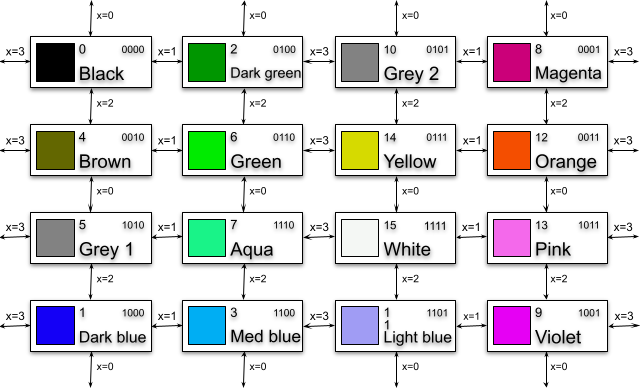

So, if we want to transition from one colour to a particular new colour, it may take up to 4 horizontal pixels before we are able to achieve it (e.g. transitioning all the way from black (0000) to white (1111)).  In the meantime we have to transition through up to 2 other colours.  Depending on the details of the image we are aiming for, this may either produce unwanted visual noise, or can actually be beneficial (e.g. if the colour we want is available immediately at the next pixel)

These constraints are difficult to work with when constructing DHGR graphics "by hand", but we can account for them programmatically in our image conversion to take full advantage of the "true" 560px resolution while accounting for colour interference effects.

#### Limitations of this colour model

In practise the above description of the Apple II colour model is still only an approximation.  On real hardware, the video signal is a continuous analogue signal, and colour is continuously modulated rather than producing discretely-coloured pixels with fixed colour values.

More importantly, in an NTSC video signal the colour (chroma) signal has a lower bandwidth than the luma (brightness) signal ([Chroma sub-sampling](https://en.wikipedia.org/wiki/Chroma_subsampling)), which means that colours will tend to bleed across more than 4 pixels.  However our simple "4-pixel chroma bleed" model already produces good results, and exactly matches the implementation behaviour of some emulators, e.g. Virtual II.

### NTSC emulation and 8-pixel colour

By simulating the NTSC (Y'UV) signal directly we are able to recover the Apple II colour output from "first principles".  Here are the 16 "basic" DHGR colours, obtained using saturation/hue parameters tuned to match OpenEmulator's NTSC implementation, and allowing chroma to bleed across 4 pixels.


However in real NTSC, chroma bleeds over more than 4 pixels, which means that we actually have more than 2^4 colours available to work with.

**When viewed on a composite colour display, Double Hi-Res graphics is not just a 16-colour graphics mode!**

If we allow the NTSC chroma signal to bleed over 8 pixels instead of 4, then the resulting colour is determined by sequences of 8 pixels instead of 4 pixels, i.e. there are 2^8 = 256 possibilities.  In practise many of these result in the same output colour, and (with this approximation) there are only 85 unique colours available.  However this is still a marked improvement on the 16 "basic" DHGR colours:

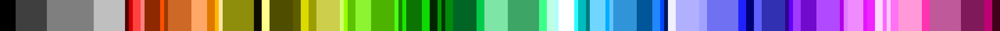

The "extra" DHGR colours are only available on real hardware, or an emulator that implements NTSC chroma sub-sampling (such as OpenEmulator).   But the result is that on such targets a much larger range of colours is available for use in image conversion.  However the restriction still exists that any given pixel only has a choice of 2 colours available (as determined by the on/off state of pixels to the left).

In practise this gives much better image quality, especially when shading areas of similar colour.  The Apple II is still unable to directly modulate the luma (brightness) NTSC signal component, so areas of low or high brightness still tend to be heavily dithered.  This is because there are more bit sequences that have the number of '1' bits close to the average than there are at the extremes, so there are correspondingly few available colours that are very bright or very dark.

These 85 unique double hi-res colours produced by the ][-pix NTSC emulation are not the definitive story - though they're closer to it than the usual story that double hi-res is a 16-colour graphics mode.  The implementation used by ][-pix is the simplest one: the Y'UV signal is averaged with a sliding window of 4 pixels for the Y' (luma) component and 8 pixels for the UV (chroma) component.

The choice of 8 pixels is not strictly correct - e.g. the chroma bandwidth (~0.6MHz) is much less than half of luma bandwidth (~2Mhz) so the signal bleeds over more than twice as many pixels; but also decays in a more complex way than the simple step function sliding window chosen here.  In practise using 8 pixels is a good compromise between ease of implementation, runtime performance and fidelity.

By contrast, OpenEmulator uses a more complex (and realistic) band-pass filtering to produce its colour output, which presumably allows even more possible colours (physical hardware will also produce its own unique results, depending on the hardware implementation of the signal decoding, and other physical characteristics).  I expect that most of these will be small variations on the above though; and in practise the ][-pix NTSC implementation already produces a close colour match for the OpenEmulator behaviour.

#### Examples of NTSC images

(Source: [Reinhold Möller](https://commons.wikimedia.org/wiki/File:Nymphaea_caerulea-20091014-RM-115245.jpg), [CC BY-SA 4.0](https://creativecommons.org/licenses/by-sa/4.0), via Wikimedia Commons)

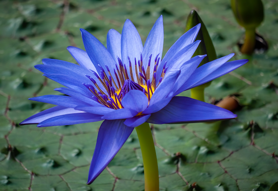

OpenEmulator screenshot of image produced with `--resolution=560 --palette=openemulator --lookahead=8`.  The distorted background colour compared to the original is particularly noticeable.

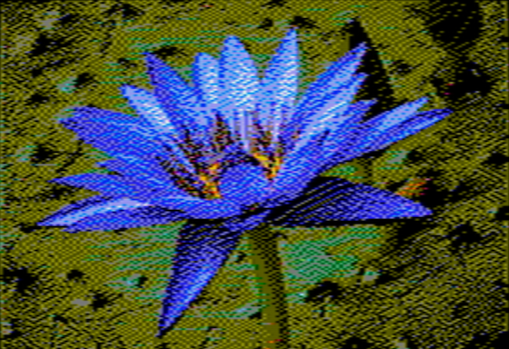

OpenEmulator screenshot of image produced with `--resolution=ntsc --lookahead=8`.  Not only is the background colour a much better match, the image shading and detail is markedly improved.

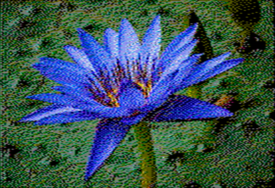

Rendering the same .dhr image with 4-pixel colour shows the reason for the difference.  For example the background shading is due to pixel sequences that with this simpler (and less hardware-accurate) rendering scheme appear as sequences of grey and dark green, with a lot of blue and red sprinkled in.  With NTSC these pixel sequences combine to produce various shades of green.  Note also that the dark green (1 pixel set; low luma) is brightened by the grey (2 pixels set; medium luma) to produce a green of medium intensity.


# Dithering and Double Hi-Res

Dithering an image to produce an approximation with fewer image colours is a well-known technique.  The basic idea is to pick a "best colour match" for a pixel from our limited palette, then to compute the difference between the true and selected colour values and diffuse this error to nearby pixels (using some pattern).

In the particular case of DHGR this algorithm runs into difficulties, because each pixel only has two possible colour choices (from a total of 16+).  If we only consider the two possibilities for the immediate next pixel then neither may be a particularly good match.  However it may be more beneficial to make a suboptimal choice now (deliberately introduce more error), if it allows us access to a better colour for a subsequent pixel.  "Classical" dithering algorithms do not account for these palette constraints, and produce suboptimal image quality for DHGR conversions. 

We can deal with this by looking ahead N pixels (6 by default) for each image position (x,y), and computing the effect of choosing all 2^N combinations of these N-pixel states on the dithered source image.

Specifically, for a fixed choice of one of these N pixel sequences, we tentatively perform the error diffusion as normal on a copy of the image, and compute the total mean squared distance from the (fixed) N-pixel sequence to the error-diffused source image.  For the perceptual colour distance metric we use [CIE2000 delta-E](https://en.wikipedia.org/wiki/Color_difference#CIEDE2000).

Finally, we pick the N-pixel sequence with the lowest total error, and select the first pixel of this N-pixel sequence for position (x,y).  We then perform error diffusion as usual for this single pixel, and proceed to x+1.

This allows us to "look beyond" local minima to find cases where it is better to make a suboptimal choice now to allow better overall image quality in subsequent pixels.  Since we will sometimes find that our choice of 2 next-pixel colours actually includes (or comes close to) the "ideal" choice, this means we can take maximal advantage of the 560-pixel horizontal resolution.

## Gamma correction

Most digital images are encoded using the [sRGB colour space](https://en.wikipedia.org/wiki/SRGB), which means that the stored RGB values do not map linearly onto the rendered colour intensities.  In order to work with linearized RGB values the source image needs to be gamma corrected.  Otherwise, the process of dithering an un-gamma-corrected image tends to result in an output that does not match the brightness of the input.  In particular shadows and highlights tend to get blown out/over-exposed.

## Dither pattern

The process of (error-diffusion) dithering involves distributing the "quantization error" (mismatch between the colour of the source image and chosen output pixels) across neighbouring pixels, according to some pattern.  [Floyd-Steinberg](https://en.wikipedia.org/wiki/Floyd%E2%80%93Steinberg_dithering) and [Jarvis-Judice-Ninke](https://en.wikipedia.org/wiki/Error_diffusion#minimized_average_error) ("Jarvis") are two common patterns, though there are many others, which have slightly different characteristics.

For our particular application it turns out that these "classical" approaches do not give especially good results.  This seems to be because they only propagate errors to a small number of neighbouring pixels, e.g. 2 pixels in the forward x direction for Jarvis.  However for double hi-res colours we know that it might take up to 4 pixels before a given colour can be selected for output (e.g. to alternate between black and white, or any other pairs that are 4 steps away on the transition chart above).

In other words, given the results of error diffusion from our current pixel, there is one colour from our palette of 16 that is the best one to match this - but it might be only possible to render this particular colour up to 4 pixels further on.  If we only diffuse the errors by 1 or 2 pixels each time, it will tend to have diffused away by the time we reach that position, and the opportunity will be lost.

Modifying the Jarvis dither pattern to extend 4 pixels in the forward direction seems to give much better results (e.g. when dithering large blocks of colour).  This is presumably because we allow each quantization error to diffuse to each of the 4 subsequent pixels that might be best-placed to act on it.  This is the default dither pattern for ][-pix (`--dither=jarvis-mod`)

Further experimentation with other dithering patterns (and similar modifications to the above) may also produce interesting results.

## Palettes

Since the Apple II graphics (prior to //gs) are not based on RGB colour, we have to choose an (approximate) RGB colour palette when dithering an RGB image.  There is no "true" choice for this palette, since it depends heavily on how the image is viewed:

1.  Different emulators have made (often quite different) choices for the RGB colour palettes used to emulate Apple II graphics on a RGB display.  This means that an image that looks good on one emulator may not look good on another (or on real hardware).
    - For example, Virtual II (and the Apple //gs) uses two different RGB shades of grey for the two DHGR grey colours, whereas they are rendered identically in NTSC.  That means that images not targeted for the Virtual II palette will look quite different when viewed there (and vice versa).

2.  Secondly, the actual display colours rendered by an Apple II are not fixed, but bleed into each other due to the behaviour of the (analogue) NTSC video signal.  i.e. the entire notion of a "16-colour RGB palette" is a flawed one.  Furthermore, the NTSC colours depend on the particular monitor/TV and its tuning (brightness/contrast/hue settings etc).  "Never Twice the Same Colour" indeed.   The model described above where we can assign from 16 fixed colours to each of 560 discrete pixels is only an approximation (though a useful one in practise).

Some emulators emulate the NTSC video signal more faithfully (e.g. OpenEmulator), in which case they do not have a true "RGB palette".  The best we can do here is measure the colours that are produced by large blocks of colour, i.e. where there is no colour blending.  Others use some discrete approximation (e.g. Virtual II seems to exactly match the colour model described above), so a fixed palette can be reconstructed.

To compute the emulator palettes used by ][-pix I measured the sRGB colour values produced by a full-screen Apple II colour image (using the colour picker tool of Mac OS X), using default emulator settings.  I have not yet attempted to measure/estimate palettes of other emulators, or "real hardware" (I don't actually have a composite colour monitor!)

Existing conversion tools (see below) tend to support a variety of RGB palette values sourced from various places (older tools, emulators, theoretical estimations etc).  In practise, these only matter in a few ways:

1.  If you are trying to target colour balance as accurately as possible for a particular viewing target (e.g. emulator), i.e. so that the rendered colour output looks as close as possible to the source image.

2.  If you are targeting an emulator that has a "non-standard" colour model, e.g. Virtual II with its two distinct shades of grey.

3.  Otherwise, choices of palette effectively amount to changing the colour balance of the source image.  Some of these might produce better image quality for a particular image  (e.g. if the source image contains large colour blocks that are difficult to approximate with a particular target palette), at the cost of changing the colour balance.  i.e. it might look good on its own but not match the source image.  You could also achieve similar results by tweaking the colour balance of the source image in an editor, e.g GIMP or Photoshop.

## Precomputing distance matrix

Computing the CIE2000 distance between two RGB colour values is fairly expensive, since the [formula](https://en.wikipedia.org/wiki/Color_difference#CIEDE2000) is complex. We deal with this by precomputing a matrix from all 256^3 integer RGB values to the 16 RGB values in a palette. This matrix is generated on disk by the `precompute_distance.py` utility, and is mmapped at runtime for efficient access.

For a 4-bit colour palette the file is 256MB; for the 8-bit NTSC colour palette it is 4GB!  Image dithering is also correspondingly slower (especially if the file cannot be mmapped completely into memory and must be demand-paged).

# Comparison to other DHGR image converters

## bmp2dhr

*  [bmp2dhr](http://www.appleoldies.ca/bmp2dhr/) (see [here](https://github.com/digarok/b2d) for a maintained code fork) supports additional graphics modes not yet supported by ][-pix, namely (double) lo-res, and hi-res.  Support for the lores modes would be easy to add to ][-pix, although hi-res requires more work to accommodate the colour model.  A similar lookahead strategy will likely work well though.

*  supports additional image dither modes

*  only supports BMP source images in a particular format.

*  DHGR conversions are treated as simple 140x192x16 colour images without colour constraints, and ignores the colour fringing behaviour described above.  The generated .bmp preview images also do not show fringing, but it is present when viewing the image on an Apple II or emulator that accounts for it.  i.e. the preview images are sometimes not very representative of the actual results.  See below for an example.

*  Apart from ignoring DHGR colour interactions, the 140px converted images are also lower than ideal resolution since they do not make use of the ability to address all 560px independently.

*  The perceptual colour distance metric used to match the best colour to an input pixel is a custom metric based on a weighted sum of Euclidean sRGB distance and Rec.601 luma value.  It's not explained why this particular metric was chosen, and in practise it seems to often give much lower quality results than CIE2000 (though the latter is much slower to compute - which is why we precompute the distance matrix ahead of time)

* It does not perform RGB colour space conversions before dithering, i.e. if the input image is in sRGB colour space (as most digital images will be) then the dithering is also performed in sRGB.  Since sRGB is not a linear colour space, the effect of dithering is to distribute errors non-linearly, which distorts the brightness of the resulting image.

## a2bestpix 

*  Like ][-pix, [a2bestpix](http://lukazi.blogspot.com/2017/03/double-high-resolution-graphics-dhgr.html) only supports DHGR conversion.  Overall quality is usually fairly good, although colours and brightness are slightly distorted (for reasons described below), and the generated preview images do not quite give a faithful representation of the native image rendering.

*  Like ][-pix, and unlike bmp2dhr, a2bestpix does apply a model of the DHGR colour interactions, albeit an ad-hoc one based on rules and tables of 4-pixel "colour blocks" reconstructed from (AppleWin) emulator behaviour.  This does allow it to make use of (closer to) full 560px resolution, although it still treats the screen as a sequence of 140 4-pixel colour blocks (with some constraints on the allowed arrangement of these blocks).

*  supports additional (custom) dither modes (partly out of necessity due to the custom "colour block" model)

*  Supports a variety of perceptual colour distance metrics including CIE2000 and the one bmp2dhr uses.  In practise I'm not sure the others are useful since CIE2000 is the most recent refinement of much research on this topic, and is the most accurate.

* like bmp2dhr, only supports BMP source images in a particular format.

*  Does not apply gamma correction before dithering (though sRGB conversion is done when computing CIE2000 distance), so errors are diffused non-linearly.  The resulting images don't match the brightness of the original, e.g. shadows/highlights tend to be over-exposed.

*  image conversion performs an optimization over groups of multiple pixels (via choice of "colour blocks").  From what I can tell this minimizes the total colour distance from a fixed list of colour blocks to a group of 4 target pixels, similar to --lookahead=4 for ][-pix (though I'm not sure it's evaluating all 2^4 pixel combinations).  But since the image is (AFAICT) treated as a sequence of (non-overlapping) 4-pixel blocks this does not result in optimizing each output pixel independently.

*  The list of "colour blocks" seem to contain colour sequences that cannot actually be rendered on the Apple II.  For example compare the spacing of yellow and orange pixels on the parrot between the preview image (LHS) and openemulator (RHS): 

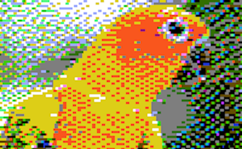
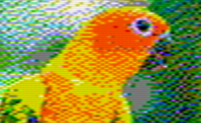

*  Other discrepancies are also visible when comparing these two images.  This means that (like bmp2dhr) the generated "preview" image may not closely match the native image, and the dithering algorithm is also optimizing over a slightly incorrect set of colour sequences, which presumably impacts image quality.  Possibly these are transcription errors, or artifacts of the particular emulator (AppleWin) from which they were reconstructed.

*  See below for another example where the output has major image discrepancies with the original - perhaps also due to bugs/omissions in the table of colour blocks.

## Image comparisons

These three images were converted using the same target (openemulator) palette, using ][-pix, bmp2dhr and a2bestpix (since this is supported by all three), and are shown as screenshots from openemulator.

### Original
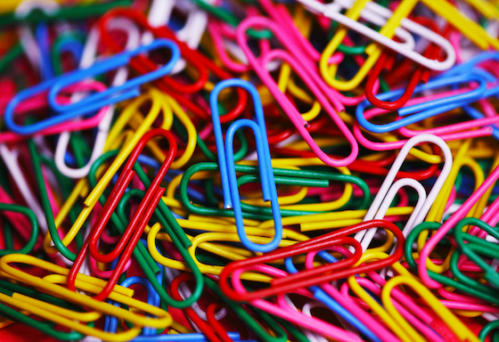

(Source: [Purple Sherbet Photography from Worldwide!](https://commons.wikimedia.org/wiki/File:Colourful_assortment_of_paper_clips_(10421946796).jpg), [CC BY 2.0](https://creativecommons.org/licenses/by/2.0), via Wikimedia Commons)

The following images were generated with a palette approximating OpenEmulator's colours (`--palette=openemulator` for ][-pix)

### ][-pix 4-pixel colour

Preview image and OpenEmulator screenshot

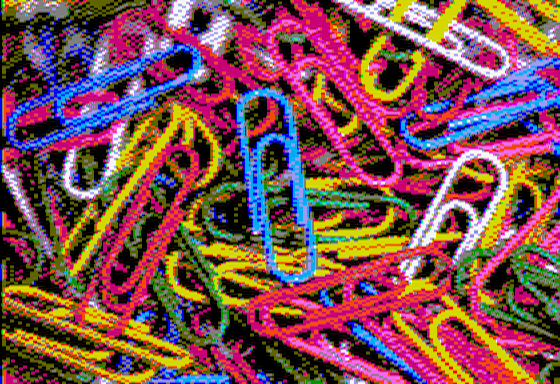
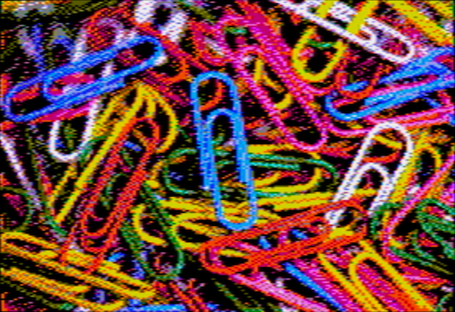

### ][-pix NTSC 8-pixel colour (Preview image)

Preview image and OpenEmulator screenshot

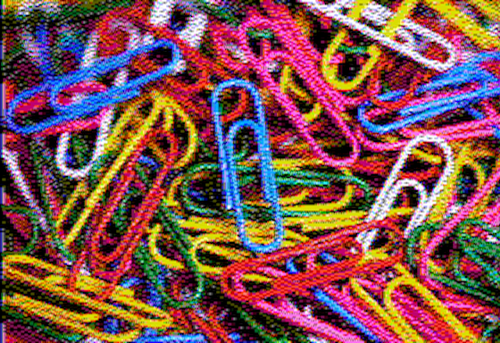
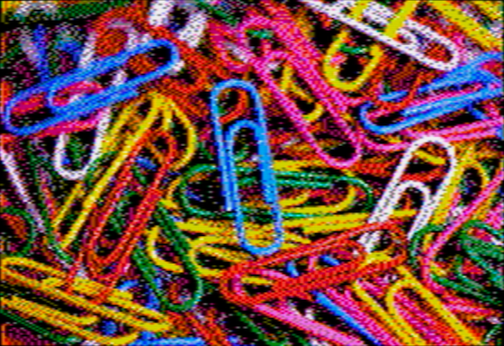

### bmp2dhr (OpenEmulator screenshot)
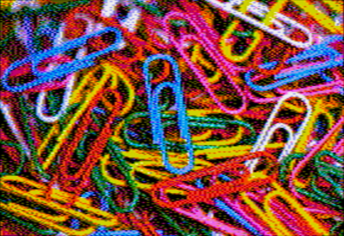

Comparing bmp2dhr under openemulator is the scenario most favourable to it, since the 140px resolution and non-treatment of fringing is masked by the chroma blending.  Colours are similar to ][-pix, but the 140px dithering and lack of gamma correction results in less detail, e.g. in hilights/shadows.

### a2bestpix (OpenEmulator screenshot)

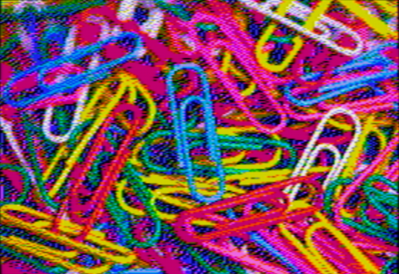

This a2bestpix image is actually atypical in quality, and shows some severe colour errors relating to the pixels that should be close to the orange/brown colours.  These may be due to errors/omissions in the set of "colour blocks".  The effects of not gamma-correcting the source image can also be seen.

## NTSC artifacts

The difference in treatment of NTSC artifacts is much more visible when using an emulator that doesn't perform chroma subsampling, e.g. Virtual II.  i.e. it displays the full 560-pixel colour image without blending.

### Original

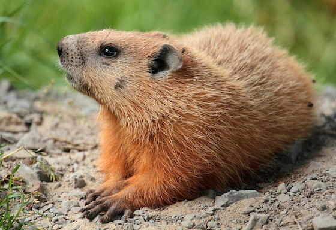

(Source: [Cephas](https://commons.wikimedia.org/wiki/File:Marmota_monax_UL_04.jpg), [CC BY-SA 3.0](https://creativecommons.org/licenses/by-sa/3.0), via Wikimedia Commons)

The following images were generated with a palette matching the one used by Virtual II  (`--palette=virtualii` for ][-pix)

### ][-pix (Preview image)


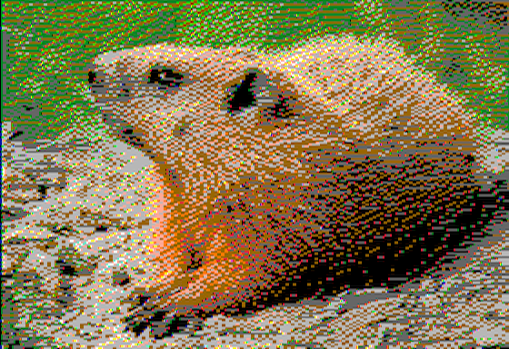

### ][-pix (Virtual II screenshot)


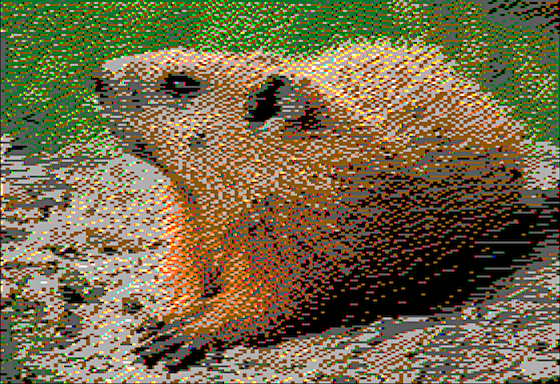

### bmp2dhr


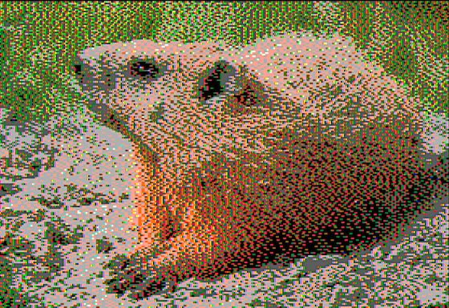

The image is heavily impacted by colour fringing, which bmp2dhr does not account for at all.  The difference in brightness of the groundhog's flank is also because bmp2dhr does not gamma-correct the image, so shadows/highlights tend to get blown out.

### bmp2dhr (OpenEmulator)


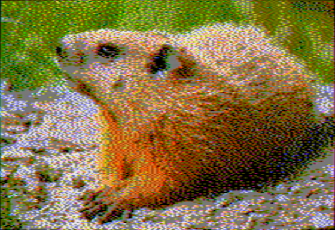

This bmp2dhr image was generated using a palette approximating OpenEmulator's colours (`--palette=openemulator` for ][-pix), i.e. not the same image files as above.
On OpenEmulator, which simulates NTSC chroma sub-sampling, the fringing is not pronounced but changes the colour balance of the image, e.g. creates a greenish tinge.

### ][-pix, 4-pixel colour (OpenEmulator)


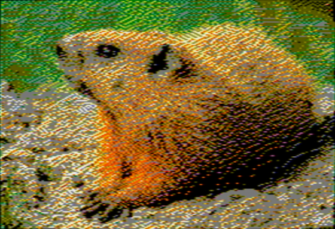

Colour balance here is also slightly distorted due to not fully accounting for chroma blending.

### ][-pix, NTSC 8-pixel colour (OpenEmulator)


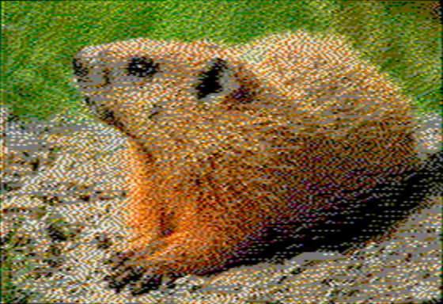

Detail and colour balance is much improved.

# Future work

* Supporting lo-res and double lo-res graphics modes would be straightforward.

* Hi-res will require more care, since the 560 pixel display is not individually dot addressible.  In particular the behaviour of the "palette bit" (which shifts a group of 7 dots to the right by 1) is another optimization constraint.  In practise a similar lookahead algorithm should work well though.

* I would like to be able to find an ordered dithering algorithm that works well for Apple II graphics.  Ordered dithering specifically avoids diffusing errors arbitrarily across the image, which produces visual noise (and unnecessary deltas) when combined with animation.  For example such a thing may work well with my II-Vision video streamer.  However the properties of NTSC artifact colour seem to be in conflict with these requirements, i.e. pixel changes *always* propagate colour to some extent.
