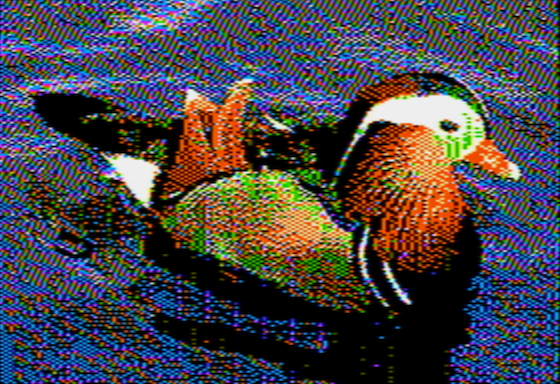

# ][-pix 2.1

][-pix is an image conversion utility targeting Apple II graphics modes, currently Hi-Res (all models), Double Hi-Res
(enhanced //e, //c, //gs) and Super Hi-Res (//gs).

## Installation

Requires:
* python 3.x
* [colour-science](https://www.colour-science.org/)
* [cython](https://cython.org/)
* [numpy](http://numpy.org/)
* [Pillow](https://python-pillow.org/)
* [pygame](https://www.pygame.org/)
* [scikit-learn](https://scikit-learn.org/)

These dependencies can be installed using the following command:

```buildoutcfg
# Install python dependencies
pip install -r requirements.txt
```

To build ][-pix, run the following commands:

```buildoutcfg
# Compile cython code
python setup.py build_ext --inplace

# Precompute colour conversion matrices, used as part of image optimization
python precompute_conversion.py
```

# Usage

To convert an image, the basic command is:

```bash
python convert.py <mode> [<flags>] <input> <output>
```
where
* `mode` is one of the following:
    * `hgr` for Hi-Res Colour (560x192 but only half of the horizontal pixels may be independently controlled)
    * `dhr` for Double Hi-Res Colour (560x192)
    * `dhr_mono` for Double Hi-Res Mono (560x192)
    * `shr` for Super Hi-Res (320x200)
* `input` is the source image file to convert (e.g. `my-image.jpg`)
* `output` is the output filename to produce (e.g. `my-image.dhr`)

The following flags are supported in all modes:

* `--show-input` Whether to show the input image before conversion. (default: False)
* `--show-output` Whether to show the output image after conversion. (default: True)
* `--save-preview` Whether to save a .PNG rendering of the output image (default: True)
* `--verbose` Show progress during conversion (default: False)
* `--gamma-correct` Gamma-correct image by this value (default: 2.4)

For other available options, use `python convert.py <mode> --help`

See below for mode-specific instructions.

## Hi-Res

To convert an image to Hi-Res the simplest usage is:

```buildoutcfg
python convert.py hgr <input> <output.hgr>
```

`<output.hgr>` contains the hires image data in a form suitable for transfer to an Apple II disk image.

TODO: document flags

TODO: add more details about HGR - resolution and colour model.

## Double Hi-Res

To convert an image to Double Hi-Res (560x192, 16 colours but [it's complicated](docs/dhr.md)), the simplest usage is:

```buildoutcfg
python convert.py dhr --palette ntsc <input> <output.dhr>
```

`<output.dhr>` contains the double-hires image data in a form suitable for transfer to an Apple II disk image.  The 16k output consists of 8k AUX data first, 8K MAIN data second (this matches the output format of other DHGR image converters).  i.e. if loaded at 0x2000, the contents of 0x2000..0x3fff should be moved to 0x4000..0x5fff in AUX memory, and the image can be viewed on DHGR page 2.

By default, a preview image will be shown after conversion, and saved as `<output>-preview.png`

TODO: document flags

For more details about Double Hi-Res graphics and the conversion process, see [here](docs/dhr.md).

## Super Hi-Res

To convert an image to Super Hi-Res (320x200, up to 256 colours), the simplest usage is:

```buildoutcfg
python convert.py shr <input> <output.shr>
```

i.e. no additional options are required.  In addition to the common flags described above, these additional flags are
supported for `shr` conversions:
* `--save-intermediate` Whether to save each intermediate iteration, or just the final image (default: False)
* `--fixed-colours` How many colours to fix as identical across all 16 SHR palettes. (default: 0)
* `--show-final-score` Whether to output the final image quality score (default: False)

TODO: link to KansasFest 2022 talk slides/video for more details

# Examples

## Hi-Res

This image was generated using

```buildoutcfg
python convert.py hgr examples/hgr/mandarin-duck.jpg examples/hgr/mandarin-duck.bin
```
The image on the right is a screenshot taken from OpenEmulator.

|  |  |
|--------------------------------------------------|---------------------------------------------------------------|

(Source: [Adrian Pingstone](https://commons.wikimedia.org/wiki/File:Mandarin.duck.arp.jpg), public domain, via Wikimedia Commons)

|  |  |
|---|---|

(Source: [Devanath](https://www.pikist.com/free-photo-srmda/fr), public domain)

TODO: add more hi-res images

## Double Hi-Res

See [here](examples/dhr/gallery.md) for more sample Double Hi-Res image conversions.

### Original


 (Source: [Shreygadgil](https://commons.wikimedia.org/wiki/File:Vibrant_Wings.jpg), [CC BY-SA 4.0](https://creativecommons.org/licenses/by-sa/4.0), via Wikimedia Commons)

### ][-pix preview image

This image was generated using

```buildoutcfg
python convert.py dhr --lookahead 8 --palette openemulator examples/dhr/parrots-original.png examples/dhr/parrots-iipix-openemulator.dhr
```

The resulting ][-pix preview PNG image is shown here.


### OpenEmulator screenshot

This is a screenshot taken from OpenEmulator when viewing the Double Hi-res image.


Some difference in colour tone is visible due to blending of colours across pixels (e.g. brown blending into grey, in the background).  This is due to the fact that OpenEmulator simulates the reduced chroma bandwidth of the NTSC signal.

][-pix also allows modeling this NTSC signal behaviour, which effectively allows access to more than 16 DHGR colours, through carefully chosen sequences of pixels (see below for more details).  The resulting images have much higher quality, but only when viewed on a suitable target (e.g. OpenEmulator, or real hardware).  On other targets the colour balance tends to be skewed, though image detail is still good.

This is an OpenEmulator screenshot of the same image converted with `--palette=ntsc` instead of `--palette=openemulator`.  Colour match to the original is substantially improved, and more colour detail is visible, e.g. in the shading of the background.


## Super Hi-Res

See [here](examples/shr/gallery.md) for more sample Super Hi-Res image conversions.

### Original


 (Source: [Alexis LOURS](https://commons.wikimedia.org/wiki/File:European_rabbit_(Oryctolagus_cuniculus)_kitten.jpg), Licensed under [Creative Commons Attribution 2.0 Generic](https://creativecommons.org/licenses/by/2.0/deed.en), via Wikimedia Commons)

### ][-pix preview image

This image was generated using

```buildoutcfg
python convert.py shr examples/shr/rabbit-kitten-original.png examples/shr/rabbit-kitten-original.shr
```


# Future work

* Supporting lo-res and double lo-res graphics modes, and super hi-res 3200 modes would be straightforward.

* Super hi-res 640 mode would also likely require some investigation, since it is a more highly constrained optimization problem than 320 mode.

* I would like to be able to find an ordered dithering algorithm that works well for Apple II graphics.  Ordered dithering specifically avoids diffusing errors arbitrarily across the image, which produces visual noise (and unnecessary deltas) when combined with animation.  For example such a thing may work well with my [II-Vision](https://github.com/KrisKennaway/ii-vision) video streamer.  However the properties of NTSC artifact colour seem to be in conflict with these requirements, i.e. pixel changes *always* propagate colour to some extent.

# Version history

## v2.2 (2023-02-03)

* Added support for HGR colour conversions

## v2.1 (2023-01-21)

* Added support for DHGR mono conversions
* Fixed compatibility with python 3.10

## v2.0 (2022-07-16)

* Added support for Super Hi-Res 320x200 image conversions

## v1.1 (2021-11-05)

* Significantly improved conversion performance
* Switched from using CIE2000 delta-E perceptual distance metric to Euclidean distance in CAM16-UCS space.  Image quality is improved, it requires much less precomputed memory (192MB cf 4GB for the 8-pixel colour mode!) and is much faster at runtime.  Win-win-win!
* Removed support for 140px conversions since these were only useful to show why this is not the right approach to DHGR
* Add support for modifying gamma correction, which is sometimes useful for tweaking results with very bright or dark source images.
* Switch default to --dither=floyd, which seems to produce the best results with --palette=ntsc
* Various internal code simplifications and cleanups

## v1.0 (2021-03-15)

Initial release


