# Gallery of images

Here are some more images converted with ][-pix.

* (top-left) original image
* (top-right) image converted for display in Virtual II emulator (converted with `--palette virtualii --lookahead 8`)
* (bottom-left) OpenEmulator screenshot of image converted with 8-pixel colour (converted with `--palette ntsc --lookahead 8`)
* (bottom-left) OpenEmulator screenshot of image converted with 4-pixel colour (converted with `--palette openemulator --lookahead 8`)

 

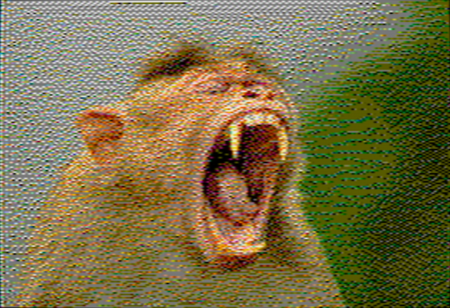 

(Source: [T. R. Shankar Raman](https://commons.wikimedia.org/wiki/File:Bonnet_Macaque_DSC_1125.jpg), [CC BY-SA 4.0](https://creativecommons.org/licenses/by-sa/4.0), via Wikimedia Commons)

 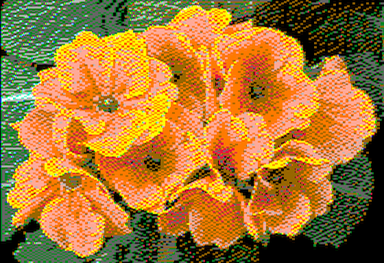 

 

(Source: [André Karwath aka Aka](https://commons.wikimedia.org/wiki/File:Primula_aka.jpg), [CC BY-SA 2.5](https://creativecommons.org/licenses/by-sa/2.5), via Wikimedia Commons)

  

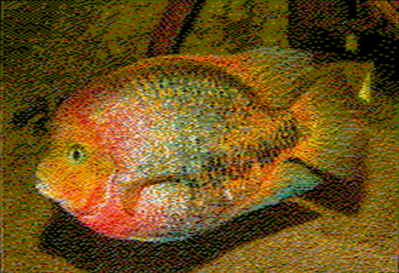 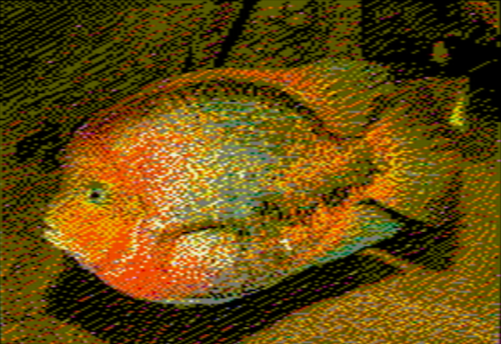  

(Source: [H. Zell](https://commons.wikimedia.org/wiki/File:Vieja_melanura_-_Karlsruhe_Zoo_01.jpg), [CC BY-SA 3.0](https://creativecommons.org/licenses/by-sa/3.0), via Wikimedia Commons)

 

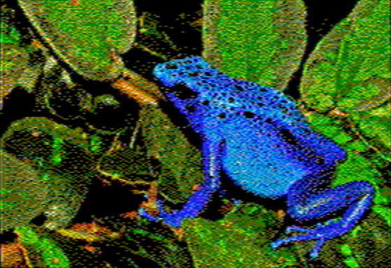 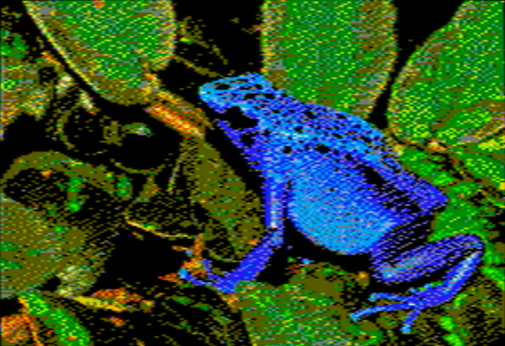  

(Source: [Michael Gäbler](https://commons.wikimedia.org/wiki/File:Dendrobates_azureus_(Dendrobates_tinctorius)_Edit.jpg), [CC BY 3.0](https://creativecommons.org/licenses/by/3.0), via Wikimedia Commons)

  

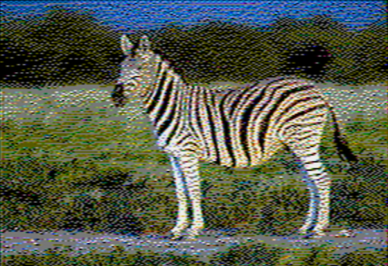   

(Source: [Yathin S Krishnappa](https://commons.wikimedia.org/wiki/File:Equus_quagga_burchellii_-_Etosha,_2014.jpg), [CC BY-SA 3.0](https://creativecommons.org/licenses/by-sa/3.0), via Wikimedia Commons)

 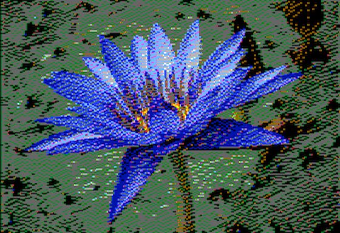  

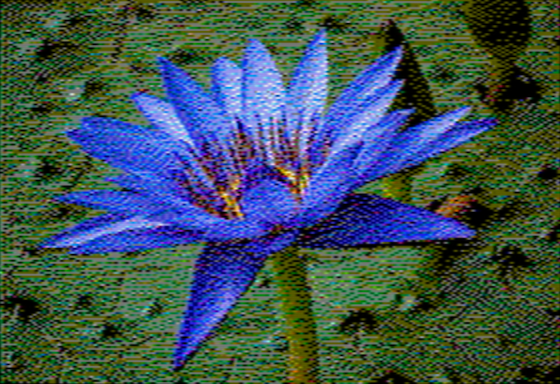 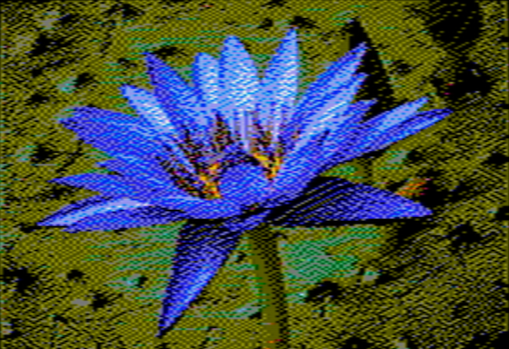

(Source: [Reinhold Möller](https://commons.wikimedia.org/wiki/File:Nymphaea_caerulea-20091014-RM-115245.jpg), [CC BY-SA 4.0](https://creativecommons.org/licenses/by-sa/4.0), via Wikimedia Commons)

 

 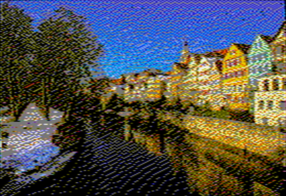

(Source: [Roman Eisele](https://commons.wikimedia.org/wiki/File:T%C3%BCbingen_-_Neckarfront_mit_vereistem_Neckar.jpg), [CC BY-SA 4.0](https://creativecommons.org/licenses/by-sa/4.0), via Wikimedia Commons)

 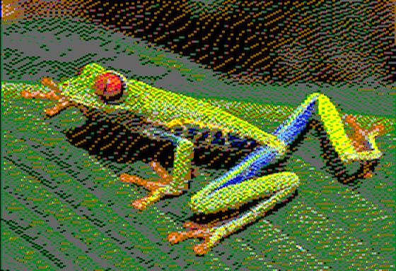 

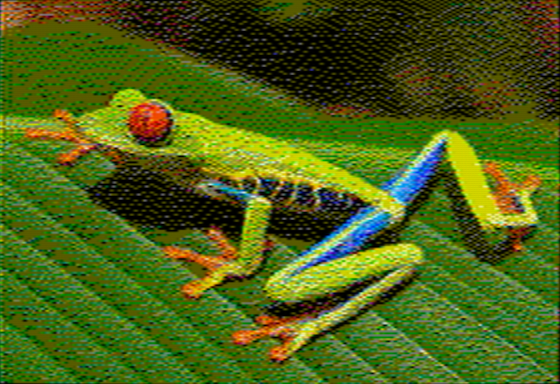 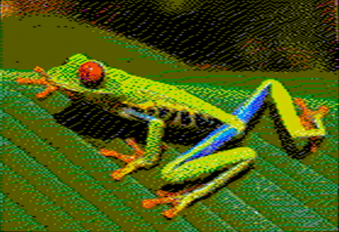

(Source: [Careyjamesbalboa (Carey James Balboa)](https://commons.wikimedia.org/wiki/File:Red_eyed_tree_frog_edit2.jpg), Public domain, via Wikimedia Commons)

 

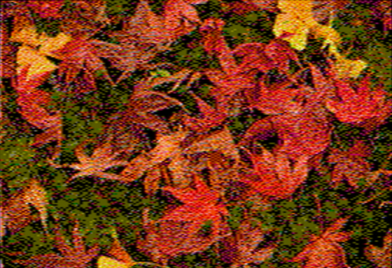 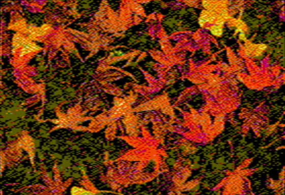

(Source: [Takeshi Kuboki from Amagasaki, Japan](https://commons.wikimedia.org/wiki/File:Autumn_foliage_2012_(8253659960).jpg), [CC BY 2.0](https://creativecommons.org/licenses/by/2.0), via Wikimedia Commons)

 

 

(Source: [Basotxerri](https://commons.wikimedia.org/wiki/File:Galt%C3%BCr_-_Pferdekopf_01.jpg), [CC BY-SA 4.0](https://creativecommons.org/licenses/by-sa/4.0), via Wikimedia Commons)

 

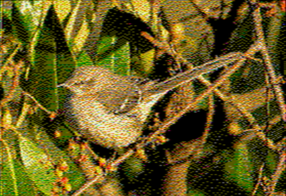 

(Source: [Rhododendrites](https://commons.wikimedia.org/wiki/File:Mockingbird_in_GWC_(71606).jpg), [CC BY-SA 4.0](https://creativecommons.org/licenses/by-sa/4.0), via Wikimedia Commons)

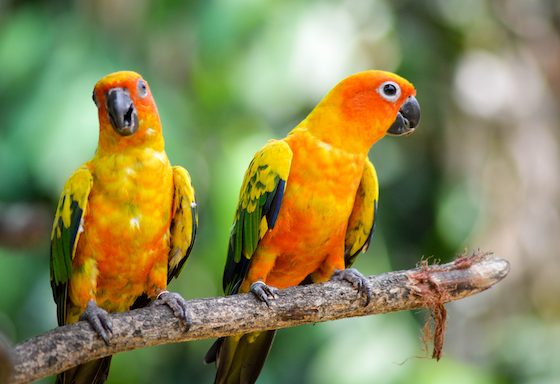 

 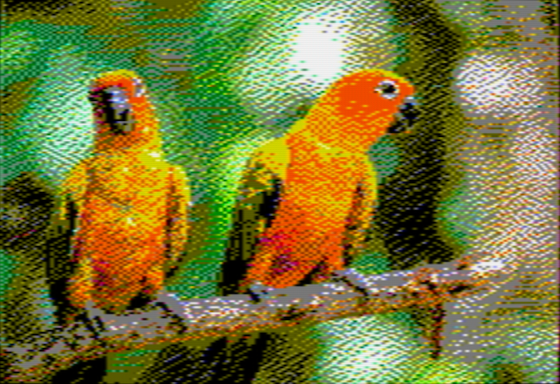

 (Source: [Shreygadgil](https://commons.wikimedia.org/wiki/File:Vibrant_Wings.jpg), [CC BY-SA 4.0](https://creativecommons.org/licenses/by-sa/4.0), via Wikimedia Commons)

 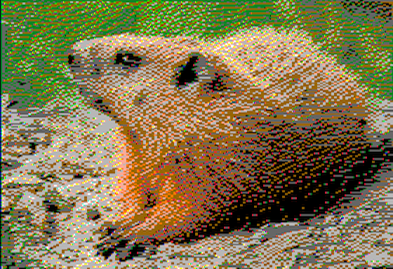

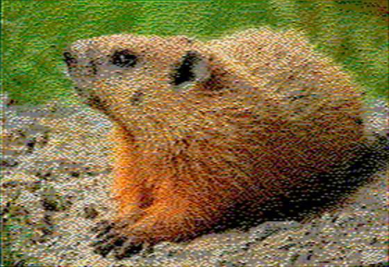 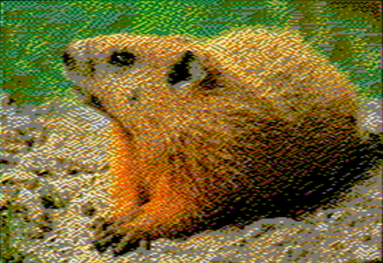

(Source: [Cephas](https://commons.wikimedia.org/wiki/File:Marmota_monax_UL_04.jpg), [CC BY-SA 3.0](https://creativecommons.org/licenses/by-sa/3.0), via Wikimedia Commons)
